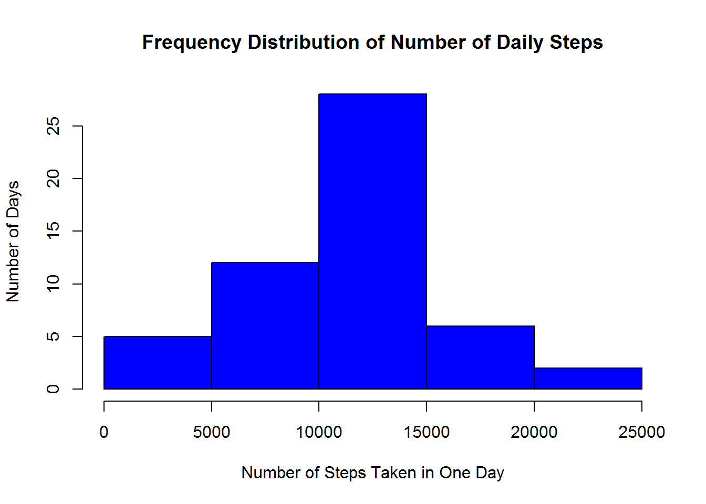
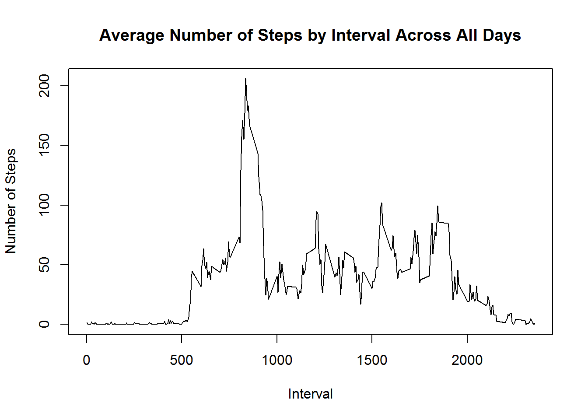
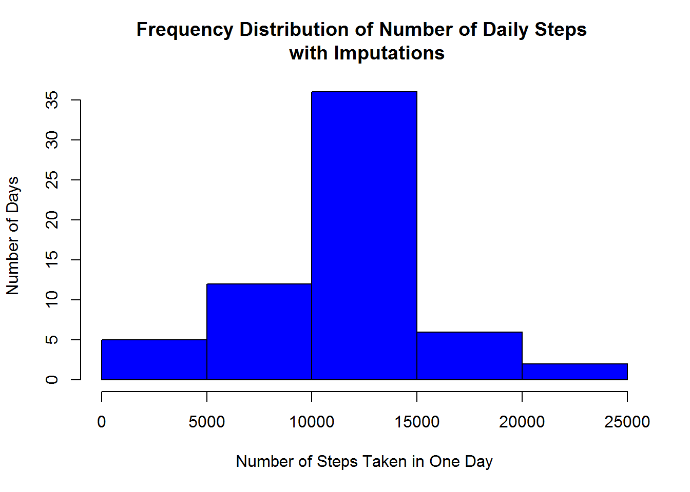
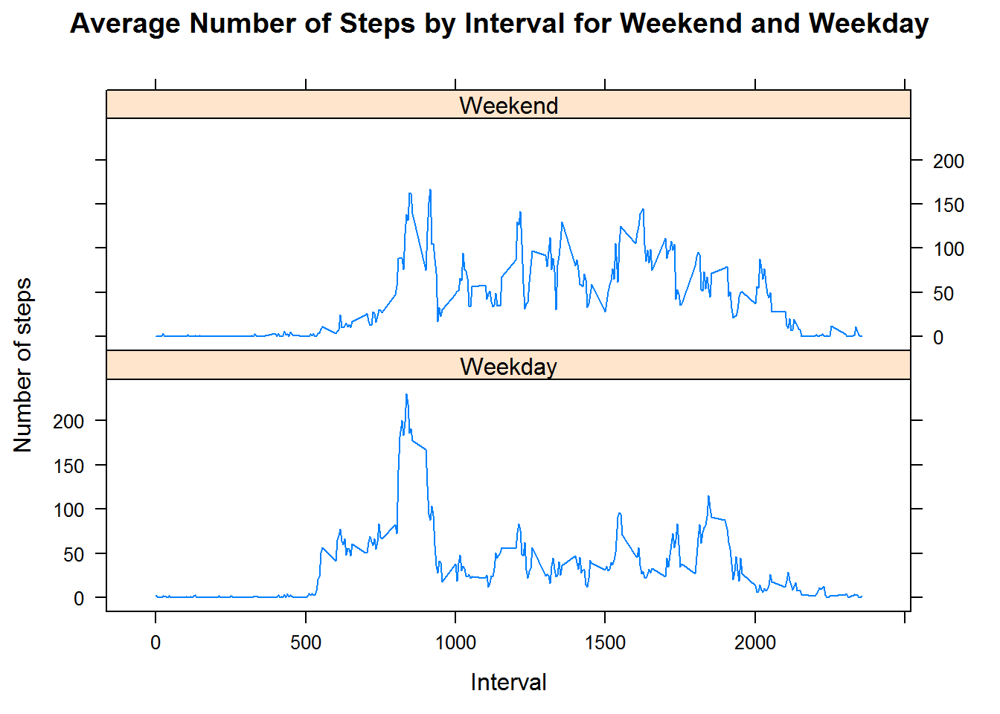

Reproducible Research: Peer Assessment 1 by Charles Park 
========================================================

## Loading and preprocessing the data
The first section assumes that you are in the local directory corresponding to the forked repository from this assignment, which 
contains an activity.zip folder housing the activity.csv file. This section of code unzips that folder and extracts the activity.csv
file into the same working directory in which this Rmd file is found. It then loads this data into a data frame named "data". 
It also loads in R libraries that will be used for data pre-processing. 

```r
unzip(zipfile = "./activity.zip", exdir = ".")
data <- read.csv("activity.csv")
library(dplyr)
library(sqldf)
library(lubridate)
library(lattice)
```

## What is mean total number of steps taken per day?
In this section, we can remove the NA values from the step attribute. AFterwards, summarise the data by reporting the total 
number of steps taken each day, then ensure data1 is reported as a data frame prior to plotting histogram of total daily steps. 

```r
data1 <- data[!is.na(data$steps),]
data1 <- data1 %>% group_by(date) %>%
         summarise(sum(steps)) 
data1 <- data.frame(data1)
data1 <- rename(data1, steps = sum.steps.)
```

Afterwards, we plot a histogram of the total number of steps taken each day. 

```r
hist(data1$steps,
     col = "blue",
     main = "Frequency Distribution of Number of Daily Steps",
     xlab = "Number of Steps Taken in One Day",
     ylab = "Number of Days")
```



We also want to calculate and report the mean and median total number of steps taken per day. 

```r
mean <- mean(data1$steps)
median <- median(data1$steps) 

mean
```

```
## [1] 10766.19
```

```r
median
```

```
## [1] 10765
```

## What is the average daily activity pattern?

In this section, we make a time series plot of the 5-minute interval (x-axis) and the average number
of steps taken, averaged across all days (y-axis). Similar to the previous section, the NA values are not yet considered. 


```r
data2 <- data[!is.na(data$steps),]
data2 <- data2 %>% group_by(interval) %>%
         summarise(mean = mean(steps))
data2 <- data.frame(data2)
plot(data2, type = "l", 
     main = "Average Number of Steps by Interval Across All Days", 
     ylab = "Number of Steps",
     xlab = "Interval")
```



The next section points out the 5-minute interval, on average across all the days in the data set, which 
contains the maximum number of steps. This value is stored in the variable called max_interval. 


```r
max_interval <- data2$interval[which(data2$mean == max(data2$mean))]

max_interval
```

```
## [1] 835
```

## Imputing missing values

This section calculates and reports the total number of missing values in the data set. 

```r
n_missing <- sum(is.na(data$steps))

n_missing 
```

```
## [1] 2304
```

These missing values were imputed as the mean number of steps for that interval across all the days, then
another data set was developed by including these imputations, stored into data frame called data3. 

```r
data3 <- sqldf('SELECT data.steps as steps, data.date as date, data.interval as interval, data2.mean as mean
               FROM data LEFT JOIN data2 ON data.interval = data2.interval')
data3 <- data3 %>% 
         mutate(fullsteps = ifelse(is.na(steps) == FALSE, steps, mean)) %>%
         select(steps = fullsteps, date, interval)
```

Based on the new data frame, we repeat the process of grouping by date and generating another histogram to profile the 
frequency of total number of steps taken each day.  

```r
data4 <- data3 %>% group_by(date) %>%
         summarise(sum(steps))
data4 <- data.frame(data4)
data4 <- rename(data4, steps = sum.steps.)

hist(data4$steps,
     col = "blue",
     main = "Frequency Distribution of Number of Daily Steps \n with Imputations",
     xlab = "Number of Steps Taken in One Day",
     ylab = "Number of Days")
```



Similar to the previous sections, we again want to calculate and report the mean and median total number of steps taken per day. 

```r
mean <- mean(data4$steps)
median <- median(data4$steps) 

mean
```

```
## [1] 10766.19
```

```r
median
```

```
## [1] 10766.19
```

The overall shape of the frequency distribution remained the same; however, the imputations have increased the frequency of days having between 10,000 and 15,000 steps taken in one day, as seen by the middle bar in the second graph exceeding 35 days while the middle bar in the first graph just exceeded 25. This resulted in the median getting shifted a bit higher for the data set with imputations, to the point of being the same as 
the mean. This stated, the mean between both data sets was the same. 

## Are there differences in activity patterns between weekdays and weekends?

Here we create a new factor variable in the imputed dataset with two level: "Weekday" and "Weekend" indicating whether a given date
is a weekday or a weekend. This is done by first creating another column that encodes each day into the actual name of the day in 
the week. Since there's no in-built function, to my knowledge, of further encoding into Weekday and Weekend class, I will set up a 
dataframe that can be joined with the original data. 


```r
data5 <-  data3
data5$date <- ymd(as.character(data5$date))
data5 <- data5 %>% mutate(dayname = weekdays(data5$date)) 
dayclass <- data.frame(dayname = c("Monday", "Tuesday", "Wednesday", "Thursday", "Friday", "Saturday", "Sunday"), 
                       daytype = c("Weekday", "Weekday", "Weekday", "Weekday", "Weekday", "Weekend", "Weekend"))
data5 <- sqldf('SELECT data5.steps as steps, data5.date as date, data5.interval as interval, dayclass.daytype as daytype
                FROM data5 LEFT JOIN dayclass ON data5.dayname = dayclass.dayname')
```

Given the new data set categorized by weekday or weekend, we create a panel plot containing a time series plot of the 
5-minute interval (x-axis) and the average number of steps taken, averaged across all weekdays or weekend days. 


```r
data5 <- data5 %>% group_by(daytype, interval) %>%
         summarise(mean = mean(steps))
data5 <- data.frame(data5)

xyplot(mean ~ interval | daytype, data = data5, layout = c(1, 2), type = "l", 
       ylab = 'Number of steps',
       xlab = 'Interval',
       main = 'Average Number of Steps by Interval for Weekend and Weekday')
```



The panel plots indicate that there is more activity going on during the weekend, especially during intervals 1000 to 1500. 
This may be because during the weekdays, people are working and typical workdays are fairly sedentary in front of the computer. 
